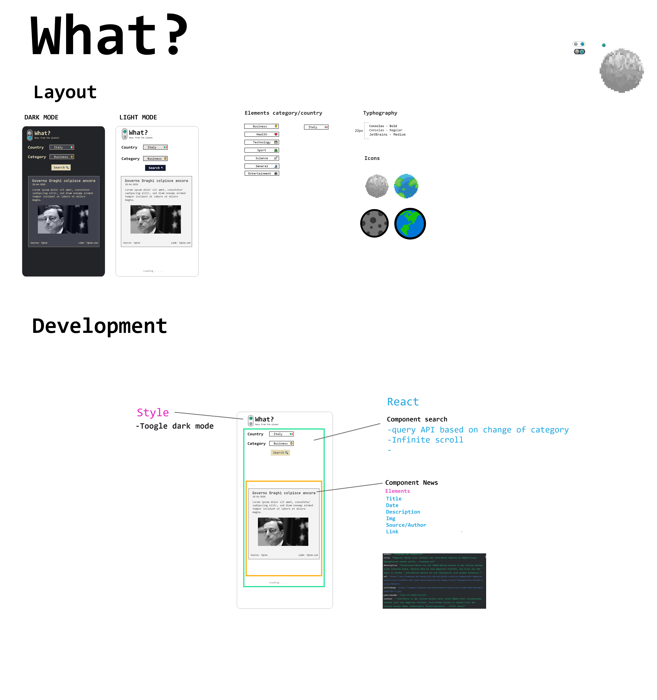

## Overview

Users should be able to:

- Search news from different country and subject with infinite scrolling

### Screenshot

### Links

- Live Site URL: [Add live site URL here](https://your-live-site-url.com)

## My process
First I've drawn the project from scratch using Adobe XD. 
I've designed the layout and the logic of my app ; so important when you are using react components.

### Built with

- [TypeScript]
- [React](https://reactjs.org/) - JS library
- [Styled Components](https://styled-components.com/) - For styles

**Note: These are just examples. Delete this note and replace the list above with your own choices**

### What I learned

I've learned how is important make a good work plan before coding.
In the technical part I've learned how to manage useEffect that create the infinite loops side-effect.

### Useful resources

Api used:
- [NewsApi](https://newsapi.org/) 

## Author

- Website - [Diego Massarini](https://diego-slicecode.dev/)
- Twitter - [@slicecodediego](https://twitter.com/slicecodediego)

