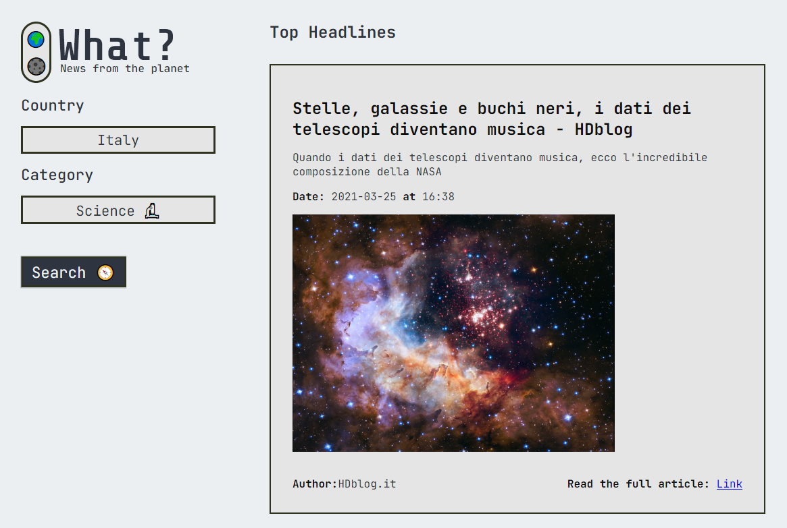
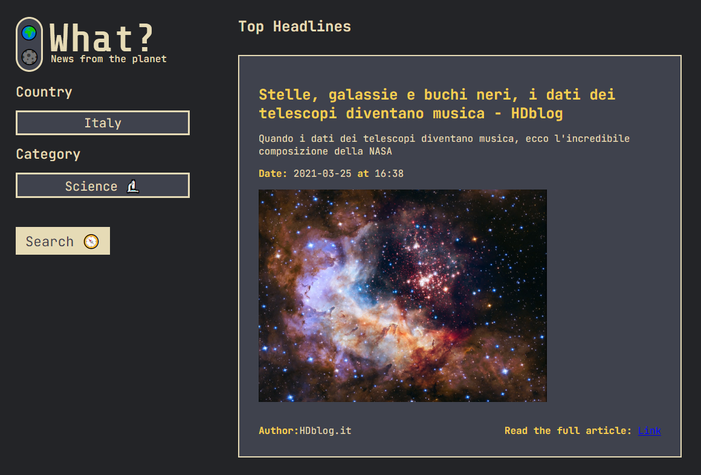
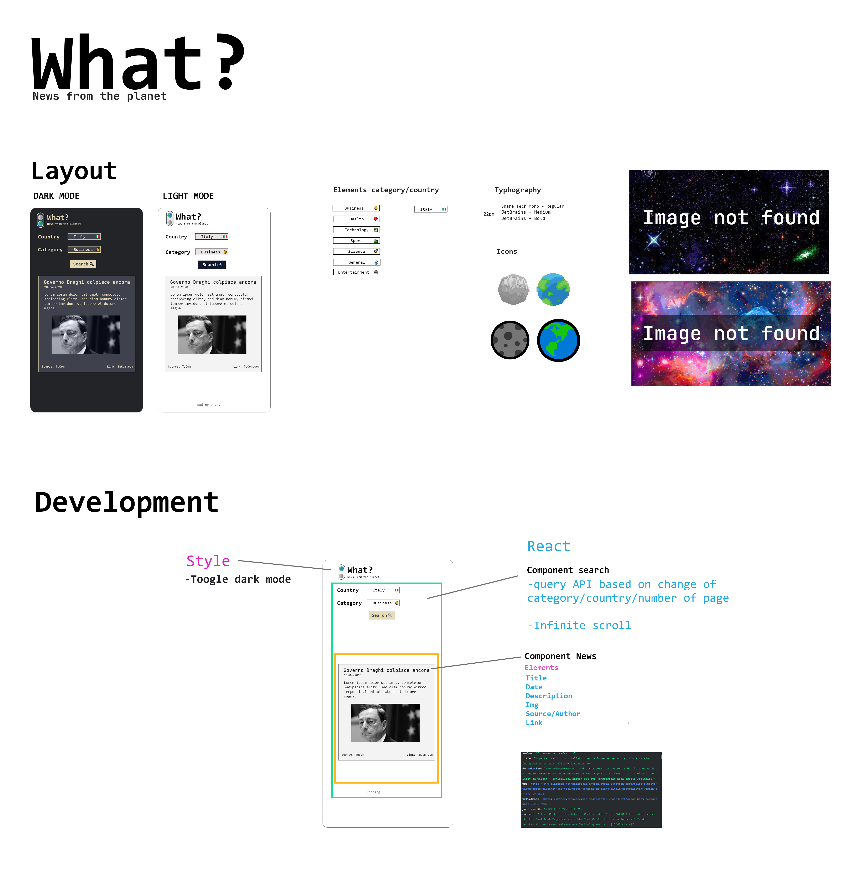

## Overview

Users should be able to:

- Search news from different country and subject with infinite scrolling

### Screenshot

### Links

- Live Site URL: [What? News from the planet](https://what-news-from-the-planet.netlify.app/)

## > UNFORTUNATELY THE WEBSITE CAN ONLY SHOW NEWS THROUGH AN API PAID PLAN, IF YOU ARE INTERESTED IN SEEING THE COMPLETE PROJECT YOU CAN CLONE IT ON YOUR TERMINAL WHERE THE DEVELOPMENT API IS AVAILABLE INSIDE.

## My process
First I've drawn the project from scratch using Adobe XD. 
I've designed the layout and the logic of my app ; very important when you are using react components.
Also I was able to practice using React and Typescript,my learning subjects.

### Built with

- [TypeScript](https://www.typescriptlang.org/)
- [React](https://reactjs.org/) - JS library
- [Styled Components](https://styled-components.com/) - For styles

### What I learned

I've learned how is important make a good work plan before coding.
In the technical part I've learned how to manage useEffect that create the infinite loops side-effect and first of all practising React and Typescript my subject of learning.

### Useful resources

Api used:
- [NewsApi](https://newsapi.org/) 

Npm used:
- [React - Lazy Load](https://www.npmjs.com/package/react-lazy-load-image-component) 
- [React - Infinite Scroll](https://www.npmjs.com/package/react-infinite-scroll-component) 

## Author

- Website - [Diego Massarini](https://diego-slicecode.dev/)
- Twitter - [@slicecodediego](https://twitter.com/slicecodediego)

